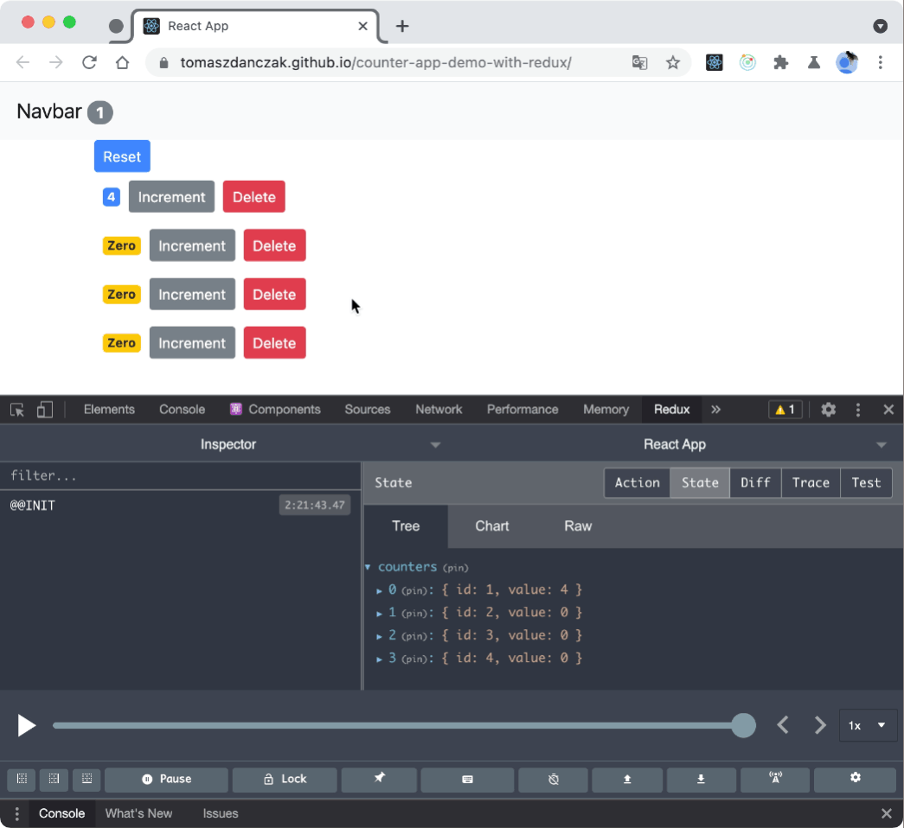
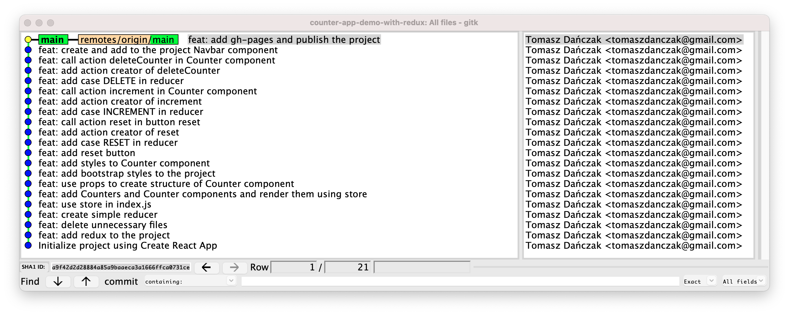

# 🌱 This is my work with [React JS - React Tutorial for Beginners](https://www.youtube.com/watch?v=Ke90Tje7VS0)
  

## See [Live 🚀](https://tomaszdanczak.github.io/counter-app-demo-with-redux/)   
## About

To build the mini project I used redux instead of state in React as it was shown in [Mosh tutorial](https://www.youtube.com/watch?v=Ke90Tje7VS0).  

> These are my first steps with Redux.  

I used basic concepts of redux following [Redux For Beginners | React Redux Tutorial](https://www.youtube.com/watch?v=CVpUuw9XSjY). This is the best tutorial on Redux which I have seen till now. 🎉 🎁

## Also I built clear Git history
  
